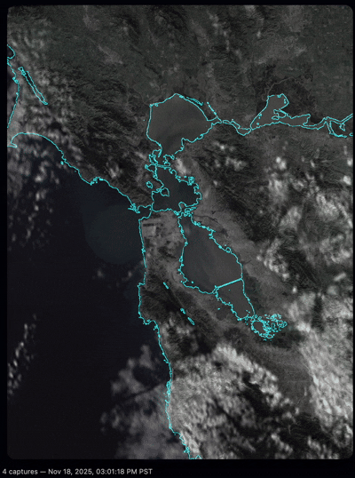
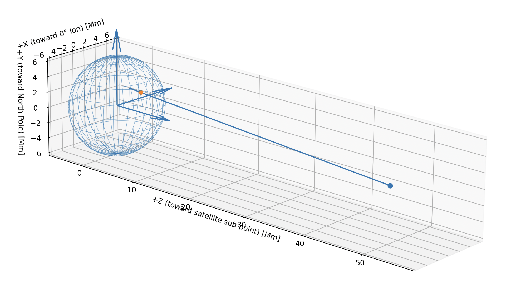

# Bay Area Clouds and Fog – GOES-18 Visuals for San Francisco



Bay Area Clouds and Fog continuously pulls GOES-18 ABI Channel 2 data for the Bay Area, reprojects it so you see the atmosphere straight above San Francisco, fuses it with a high-resolution basemap, and publishes the latest frames so the website can loop through recent conditions.

## Highlights
- End-to-end fog + cloud visualization sourced from NOAA's GOES-West satellite (full-disk → cropped SF sector).
- Projection routines that orient the satellite view as if looking straight down from the city.
- Automated rendering and publishing pipeline that runs PST during dailight hours on an EC2 instance and pushes to S3-backed hosting.
- Daily cleanup jobs keep both EC2 storage and S3 renders tidy.

## Data Processing Pipeline
1. **Acquisition (GOES-West → NetCDF)**  
   `fog.fetch` downloads GOES-18 ABI L1b Channel 2 scans covering San Francisco, saving them as NetCDF for reproducibility.
2. **Projection & Calibration**  
   Projection functions in  `fog.projection.py` reprojects the geostationary grid so pixels align with a nadir view directly above SF.  
     
   
3. **Rendering**  
   `fog.render_now` upsamples to ~100 m/voxel, blends with a high-res base layer, and exports PNGs suitable for the website loop.
4. **Publishing**  
   Rendered frames sync to S3 via `fog.s3_uploader`, making them available to the public site and archival tooling.

## Infrastructure & Automation
- **Compute:** A small EC2 instance runs the renderer continuously.
- **Storage:** Outputs land in an S3 bucket that backs the live site and archives recent loops.
- **Systemd service:** Keeps `python -m fog.render_now` alive so new frames are generated as soon as data arrives.
- **Cron jobs:**  
  - `scripts/cleanup_daily_s3_renders.py` prunes old render folders in S3 each day.  
  - `bin/cleanup_renders.sh` rotates local render directories to free EC2 disk space.
- **Manual CLI:** Operators can pull a specific timestamp via `python -m fog.cli --scene-time ...` for ad-hoc analysis.

## Getting Started

```bash
python -m venv .venv
source .venv/bin/activate
pip install -e .
```

### Render a specific scene
```bash
python -m fog.cli \
  --scene-time 2023-07-01T12:30:00 \
  --output-dir ./data
```
Produces a NetCDF file for ABI Channel 2 covering the Bay Area.

### Generate the latest composite
```bash
python -m fog.render_now
```
Writes the current fog/cloud overlay to `./renders`.

### Batch an entire day
```bash
python scripts/render_all_of_today.py --interval-minutes 10
```
Iterates sunrise → sunset, reusing the renderer for each step.

## Repository Layout
```
src/fog/
  cli.py             # CLI entry point
  config.py          # GOES configuration helpers
  daily_render_cleanup.py
  fetch.py           # Data download + subset functions
  render_now.py      # Top-level render routine
  rendering.py       # Rendering primitives
  s3_uploader.py     # Upload helpers for S3 publishing
scripts/
  goes_geometry_demo.py   # Projection math visualization
  cleanup_daily_s3_renders.py
  render_all_of_today.py
bin/
  cleanup_renders.sh
docs/
  index.html         # Static site served from S3
```

